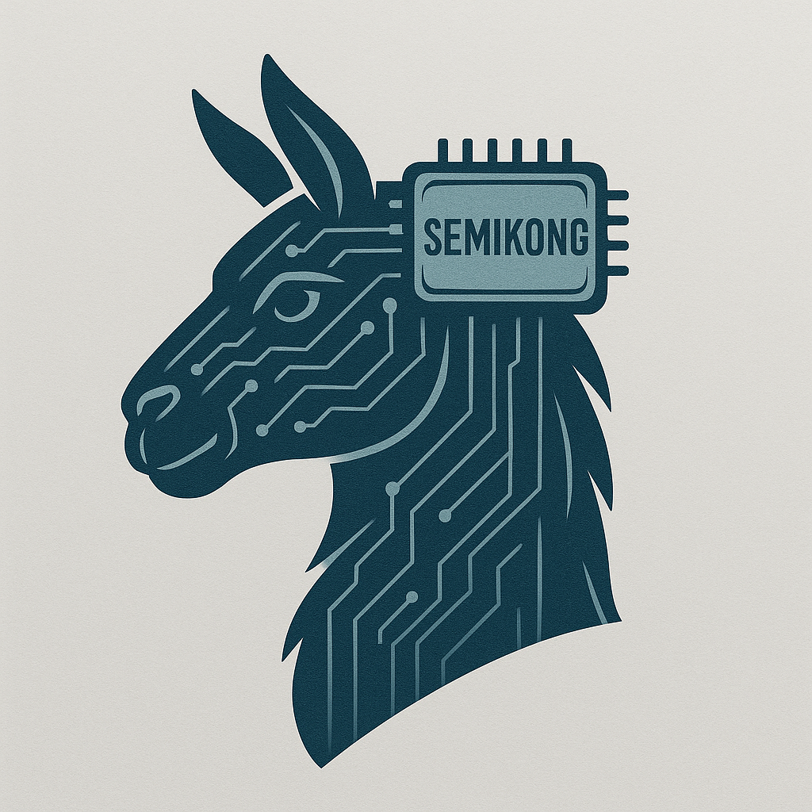

<div align="center">

<picture>
  <source media="(prefers-color-scheme: dark)" srcset="model/figures/teaser.png" width="200px">
  <source media="(prefers-color-scheme: light)" srcset="model/figures/teaser.png" width="200px">
  
</picture>

</div>

# SemiKong

SemiKong is an open-source semiconductor AI project that combines:

- a semiconductor language model in [model/](/Users/ctn/src/aitomatic/semikong/model)
- a semiconductor ontology and knowledge graph in [ontology/](/Users/ctn/src/aitomatic/semikong/ontology)

SemiKong began as an early open effort to build a semiconductor-specific language model from real industry collaboration. Publicly, it was presented through the AI Alliance ecosystem with contributions from Aitomatic, Tokyo Electron, FPT, and others, and later described by the AI Alliance as its first domain-specific open model.

The semiconductor industry depends on precise technical language, process knowledge, equipment context, materials knowledge, and long operational chains across design, fabrication, test, packaging, and supply. SemiKong is relevant because it puts two useful layers in one place:

- a model layer for question answering, generation, and domain-specific AI workflows
- an ontology layer for structure, provenance, validation, and shared semantics

That combination matters if you want AI systems that are not only fluent, but also grounded in domain structure.

SemiKong is connected to the [AI Alliance](https://aialliance.org), an open community working on open and responsible AI.

We also intend to contribute the SemiKong ontology work into the broader SEMI standards and interoperability effort where that alignment is useful and appropriate.

## Principal

- [Christopher Nguyen](https://github.com/ctn) (`ctn@aitomatic.com`)

## Papers

- [SemiKong: Curating, Training, and Evaluating A Semiconductor Industry-Specific Large Language Model](https://arxiv.org/abs/2411.13802)
  Christopher Nguyen, William Nguyen, Atsushi Suzuki, Daisuke Oku, Hong An Phan, Sang Dinh, Zooey Nguyen, Anh Ha, Shruti Raghavan, Huy Vo, Thang Nguyen, Lan Nguyen, and Yoshikuni Hirayama. arXiv:2411.13802, 2024.

```bibtex
@article{semikong2024,
  title={SemiKong: Curating, Training, and Evaluating A Semiconductor Industry-Specific Large Language Model},
  author={Nguyen, Christopher and Nguyen, William and Suzuki, Atsushi and Oku, Daisuke and Phan, Hong An and Dinh, Sang and Nguyen, Zooey and Ha, Anh and Raghavan, Shruti and Vo, Huy and Nguyen, Thang and Nguyen, Lan and Hirayama, Yoshikuni},
  journal={arXiv preprint arXiv:2411.13802},
  year={2024}
}
```

## What You Can Do Here

- use the model work under `model/` for training and inference experiments
- use the ontology work under `ontology/` for semantic modeling, validation, and knowledge-graph work
- use both together for grounded semiconductor AI workflows

## Get Started

If you want to work with the model:

```bash
make -C model install
make -C model train
make -C model infer
```

Key model entry points:

- [model/README.md](/Users/ctn/src/aitomatic/semikong/model/README.md)
- [model/INSTALL.md](/Users/ctn/src/aitomatic/semikong/model/INSTALL.md)
- [model/Makefile](/Users/ctn/src/aitomatic/semikong/model/Makefile)

If you want to work with the ontology:

- [ontology/README.md](/Users/ctn/src/aitomatic/semikong/ontology/README.md)
- [ontology/MANIFESTO.md](/Users/ctn/src/aitomatic/semikong/ontology/MANIFESTO.md)
- [ontology/ontology/README.md](/Users/ctn/src/aitomatic/semikong/ontology/ontology/README.md)

## Repository Guide

- [model/](/Users/ctn/src/aitomatic/semikong/model) contains the language model code, configs, docs, and references
- [ontology/](/Users/ctn/src/aitomatic/semikong/ontology) contains the ontology modules, shapes, curation materials, and ontology docs

## Why This Project Matters

General-purpose AI is often too shallow for semiconductor work. Real semiconductor workflows need:

- domain vocabulary that is used consistently
- knowledge that spans multiple layers of the industry
- provenance and validation for high-value technical information
- infrastructure that can support both human understanding and machine use

SemiKong is aimed at that gap.

## License

The repository code and checked-in contents are distributed under the [MIT License](/Users/ctn/src/aitomatic/semikong/LICENSE).

Some model weights, datasets, and imported ontology assets may also carry upstream licenses or provenance-specific terms.

## Historical Notes

- AI Alliance domain-model story: <https://thealliance.ai/blog/from-semiconductor-to-maritime-a-blueprint-for-dom>
- AI Alliance first-year retrospective: <https://thealliance.ai/blog/our-first-year>
