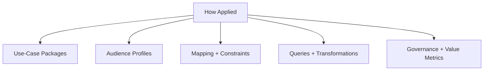

# Semicont Manifesto

## Why Semicont Exists

Semiconductor work depends on shared meaning across design, manufacturing, test, packaging, supply chain, and operations. In practice, meaning is fragmented across tools, teams, standards, and vendor dialects.

`semicont` exists to provide an open, high-quality semantic foundation that can be reused, extended, and operationalized across these boundaries.

## Core Position

Ontology work should be judged by practical outcomes, not only formal structure.

The goal is not to maximize complexity. The goal is to improve real workflows:

- Faster alignment across organizations and systems
- Clearer traceability and provenance
- Better data interoperability
- Higher confidence in analytics and automation

## Principles

1. Use-Case First

Every modeled concept should serve concrete competency questions and workflows.

2. Progressive Formalism

Start simple where possible. Add expressive logic only when it creates measurable benefit.

3. Provenance by Default

Definitions, mappings, and assertions should carry explicit provenance and version context.

4. Modular by Design

Public core + domain extensions + local overlays are preferable to monolithic models.

5. Open and Extensible

The public ontology should be straightforward to adopt in both open and proprietary environments.

6. Multi-View Clarity

`semicont` should be communicated in three views: industry layers (`who/where`), semantic core (`what`), and audience profiles (`how applied`).

7. Operational Application

The `how` layer should be structured into reusable packages: use-case packages, audience profiles, mapping specs, constraint packs, query/reasoning packs, transformation views, lifecycle governance, and value metrics.

## Open Ecosystem, Normal IP Boundaries

`semicont` is an open semantic substrate. Organizations may build differentiated internal tooling and applications around it. This is normal and healthy in industry.

Open collaboration and competitive implementation can coexist:

- Shared ontology assets improve ecosystem interoperability.
- Private implementation layers enable product differentiation.

## What Success Looks Like

- Teams adopt modules without heavyweight onboarding.
- Provenance is consistently present and auditable.
- Cross-domain mappings become easier and less ambiguous.
- External users can extend safely without forking the core model.

## Commitment

`semicont` will prioritize clarity, interoperability, and practical value. It will stay grounded in real semiconductor use cases while remaining open to broad participation and extension.

Detailed implementation of the three-view architecture is documented in [docs/architecture.md](./docs/architecture.md).

## Initial Contributor

- Christopher Nguyen (`ctn@aitomatic.com`)
