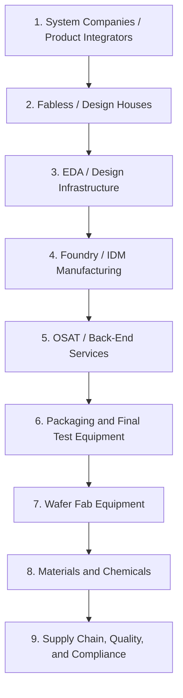
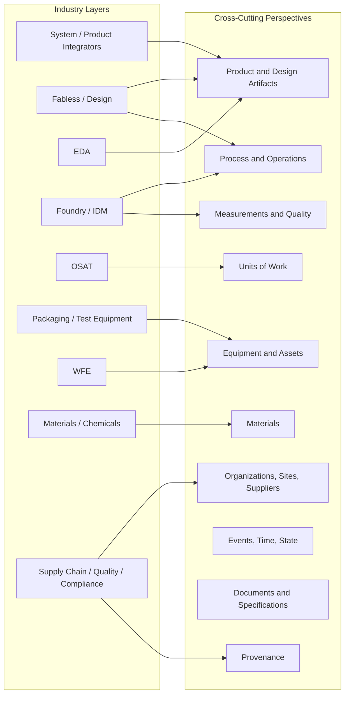
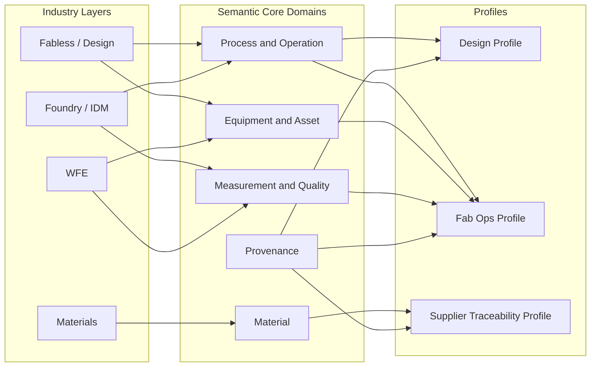

# Semicont Architecture

## Purpose

This document defines how `semicont` is organized so it stays simple to adopt, rigorous in semantics, and extensible over time.

## Three-View Model

## View-To-Directory Mapping

In this repository, view semantics map to layout and artifacts as:

1. `Who/Where`: top-level ontology partitioning by industry layer (`ontology/01-...` through `ontology/09-...`).
2. `What`: ontology terms/relations in Turtle files within each layer directory and layer subdirectories, plus shared reusable semantics in `ontology/00-shared/`.
3. `How`: operational use-case assets (rules, skills, query packs, transforms, profile constraints) colocated with each use case directory.

Operational interpretation:

1. Directory path gives stakeholder/value-chain context.
2. `.ttl` gives semantic truth.
3. Supporting artifacts define execution and application behavior.

### 1) Industry Layer View (`who/where`)

This is the stakeholder and value-chain map used for onboarding, roadmap planning, and profile ownership.

Top-to-bottom layers:

1. System Companies / Product Integrators (Apple, Google, Amazon)
2. Fabless / Design Houses (MediaTek, MaxLinear, Qualcomm)
3. EDA / Design Infrastructure (Synopsys, Cadence, Siemens EDA)
4. Foundry / IDM Manufacturing (TSMC, Samsung Foundry, Intel)
5. OSAT / Back-End Manufacturing Services (ASE, Amkor, JCET)
6. Assembly, Packaging, and Final Test Equipment (Kulicke & Soffa, ASMPT, Advantest)
7. Wafer Fab Equipment (Tokyo Electron, Applied Materials, Lam Research, ASML, KLA)
8. Materials & Chemicals (JSR, Shin-Etsu, SUMCO, Entegris)
9. Supply Chain, Quality, and Compliance (cross-layer enterprise functions)

### 2) Semantic Core View (`what`)

This is the canonical ontology model. It is cross-cutting and should not be duplicated by layer.

Core domains:

- Product and design artifact
- Process and operation
- Material
- Equipment and asset
- Measurement and quality
- Unit of work (lot, wafer, die, package, test unit)
- Organization, site, and supplier
- Event, time, and state
- Document and specification
- Provenance

## Cross-Cutting Perspectives

In practice, the ontology is managed as a matrix: value-chain layers on one axis and cross-cutting perspectives on the other.

Cross-cutting perspectives in scope:

1. Product and design artifacts
2. Process and operations
3. Materials
4. Equipment and assets
5. Measurements and quality
6. Units of work (lot, wafer, die, package, test unit)
7. Organizations, sites, and suppliers
8. Events, time, and state
9. Documents and specifications
10. Provenance

### 3) Profile View (`how applied`)

Profiles provide practical, audience-specific entry points without forking the core ontology.

Each profile should include:

- Scoped subset of terms from shared and layer-specific ontologies
- Required constraints or validation shapes
- Minimal example dataset
- Competency questions and example queries

## Why Both Layer and Core Are Required

- Layer view drives adoption, ownership, and prioritization.
- Core view ensures semantic consistency and interoperability.
- Profile view bridges both for immediate operational use.

Using only one view creates failure modes:

- Only core: hard onboarding, weak stakeholder fit.
- Only layers: duplicated semantics and fragmented models.

## Proposed Repository Mapping

- `ontology/00-shared/` canonical shared model
- `ontology/01-integrators/`
- `ontology/02-ip-providers/`
- `ontology/03-fabless/`
- `ontology/04-eda/`
- `ontology/05-foundry-idm/`
- `ontology/06-osat-packaging-test/` with root ontology plus `osat/`, `packaging/`, and `test/` subdomains
- `ontology/07-wfe/`
- `ontology/08-materials/`
- `ontology/09-supply-chain/`
- `profiles/` audience-specific profiles
- `shapes/` validation constraints
- `examples/` sample data, mappings, and queries
- `docs/` architecture and usage guides
- `releases/` versioned artifacts and release notes

## Governance Rules

1. New core terms require at least two-layer relevance, or explicit architecture justification.
2. Single-layer concepts should default to a module/profile, not core.
3. Every term and mapping must carry provenance.
4. Breaking changes require major-version bump and migration notes.
5. Profiles must not redefine core semantics; they can constrain or subset them.
