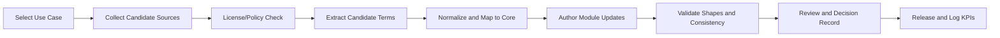

# Curation and Maintenance Methodology

## Purpose

Define a repeatable agent workflow for researching, curating, validating, and maintaining ontology modules.

## End-to-End Workflow

## Step Definitions

1. Select use case
- Choose one concrete workflow outcome and competency questions.

2. Collect candidate sources
- Gather only Tier A/B sources per `docs/source-policy.md`.

3. License/policy check
- Reject Tier C. Quarantine unclear rights.

4. Extract candidate terms
- Draft candidate classes/properties/relations plus provenance.

5. Normalize and map to core
- Reuse `core` terms first; add module-local terms only when needed.

6. Author module updates
- Update relevant `.ttl` files and metadata fields.

7. Validate shapes and consistency
- Check required metadata, provenance completeness, and module boundary rules.

8. Review and decision record
- Log semantic/governance decisions in `ontologist/DECISIONS.md`.

9. Release and log KPIs
- Update `WORKLOG.md` weekly KPIs and task status.

## Required Review Gates

1. Source rights gate
2. Provenance completeness gate
3. Semantic consistency gate
4. Change impact gate (versioning/deprecation)

## Cadence

1. Daily: small batch updates and handoff refresh (`ontologist/STATE.md`).
2. Weekly: KPI update and scope review.
3. Per release: changelog and compatibility review.
